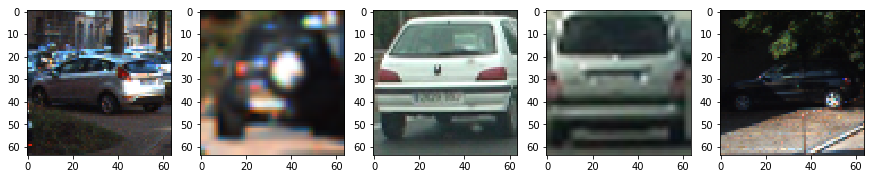
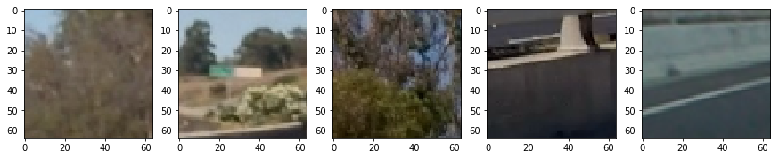
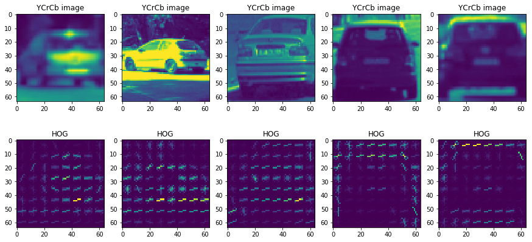
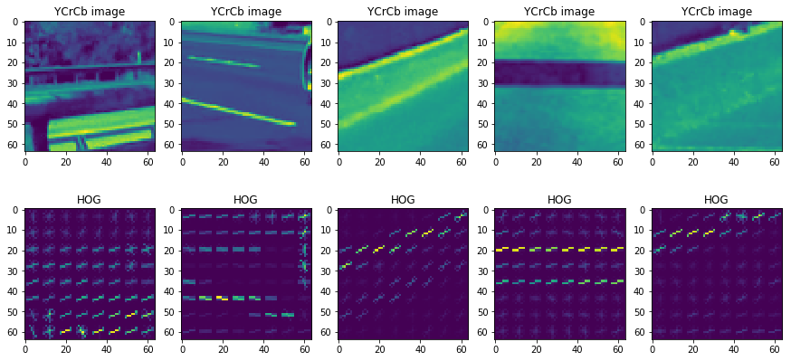
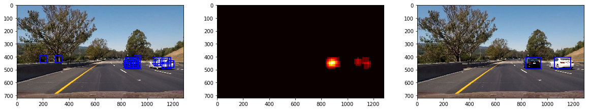
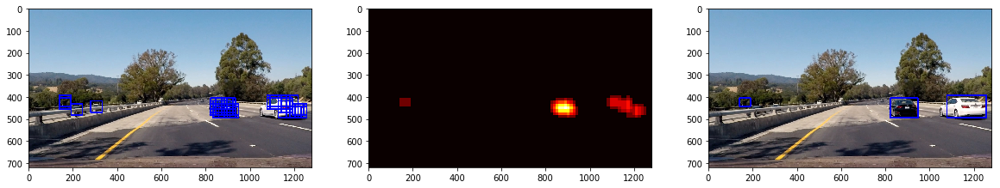
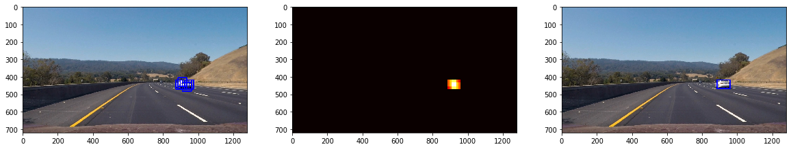

# SDC-vehicle-detection
The goal of this project is to implement a simple vehicle detection pipeline from the vision system in the car. Vehicles are detected by creating a feature vector using HOG, spatial and color histograms and training a SVM classifier on car and non-car data sets. A sliding window search is then used on the input frames to detect cars. The features vectors, heat map thresholds, sliding window scales used to train the classifier and detect car images have been experimented with quite a bit to derive at the final values.

Even though HOG feature vectors coupled with an SVM classifier is a simple approach, it is clear that these techniques are not sufficient to build a robust pipeline to detect vehicles in real time especially considering the speed of this pipeline. A hardware software hybrid approach where some of these image processing functions are implemented in hardware might be needed. 

Key steps of this project are:
* Examined the dataset of car and non-car images
* Extracted featureset for the images by appending 1) Spatial transform 2) Color histograms on all channels and 3) Histogram of Oriented Gradients (HOG) on all channels
* Train a Linear SVM classifier
* Implement a sliding window search on the input frames and use the trained classifier to search for vehicles in each window
* For all classifications, create a cumulative merged heatmap on multiple frames and apply a threshold to remove false positives. 
* Estimate a bounding box for vehicles detected

---
### Code

Run the python notebook `vehicle_detection.ipynb` for detecting vehicles in the images and video. Implementation consists of the following files located in the source directory

* source/vehicle_detection.ipynb  :   Runs the pipeline on test images and project video  
* source/tracking_pipeline.py     :   Implements functions required for feature collection, SVM classification and vehicle detection 
* out_images                      -   Folder with images at different stages of the pipeline
* out_videos                      -   Folder with lane detected output videos 

### Data Set

The data set used is comprised of images taken from the GTI vehicle image database and the KITTI vision benchmark suite. They comprise of two sets - car images and non-car images. Total data set contains about 18K images.

| Dataset       | Images        | 
|:-------------:|:-------------:| 
| Car           | 8792          | 
| Non-car       | 8968          |

Here are some random images from the Car data set



And some random images from the non-car data set



### Feature extraction and Histogram of gradients

Feature vector is generated by combining color histograms, spatial bins and histogram of gradients. The images are first converted from RGB into YCrCb color space and the above tranforms are applied.

Feature extraction is implemented in the function `tracking_pipeline/extract_features()`. Spatial binning and color histograms are implemeted as shown below.

```python
    def bin_spatial(img, size=(32, 32)):
        color1 = cv2.resize(img[:,:,0], size).ravel()
        color2 = cv2.resize(img[:,:,1], size).ravel()
        color3 = cv2.resize(img[:,:,2], size).ravel()
        return np.hstack((color1, color2, color3))

    def color_hist(img, nbins=32):    #bins_range=(0, 256)
        # Compute the histogram of the color channels separately
        channel1_hist = np.histogram(img[:,:,0], bins=nbins)
        channel2_hist = np.histogram(img[:,:,1], bins=nbins)
        channel3_hist = np.histogram(img[:,:,2], bins=nbins)
      
        # Concatenate the histograms into a single feature vector
        hist_features = np.concatenate((channel1_hist[0], channel2_hist[0], channel3_hist[0]))
        return hist_features
```

Histogram of gradients are calculated using the scikit-learn function `hog()` and implemeted through `get_hog_features()` as shown below

```python
    def get_hog_features(img, orient, pix_per_cell, cell_per_block, 
                            vis=False, feature_vec=True):
        # Call with two outputs if vis==True
        if vis == True:
            features, hog_image = hog(img, orientations=orient, 
                                  pixels_per_cell=(pix_per_cell, pix_per_cell),
                                  cells_per_block=(cell_per_block, cell_per_block), 
                                  transform_sqrt=False, 
                                  visualise=vis, feature_vector=feature_vec)
            return features, hog_image

        # Otherwise call with one output
        else:      
            features = hog(img, orientations=orient, 
                       pixels_per_cell=(pix_per_cell, pix_per_cell),
                       cells_per_block=(cell_per_block, cell_per_block), 
                       transform_sqrt=False, 
                       visualise=vis, feature_vector=feature_vec)
            return features       
```

HOG parameters of orientation, pixels per cell and cells per block were obtained by experimentation. For the color space, while RGB gave good values, converting it to YCbCr seemed to better detect car features. Final values for HOG parameters are shown below

| Parameter        | Value         | 
|:----------------:|:-------------:| 
| colorspace       | YCbCr         | 
| Channel          | ALL           |
| Orientations     | 9             | 
| pixels per cell  | 8             |
| cell per block   | 2             |

Shown below is a set of random car images from the data set with color conversion YCrCb and HOG gradients applied to Ch1



Shown below is a set of random non-car images with color conversion YCrCb and HOG gradients applied to Ch1



### Training a SV classifier
The next step is to train a linear support vector classifier. To do this first, the feature set is normalized and separated into a 80/20 train to test splot.

```python
X = np.vstack((car_features, notcar_features)).astype(np.float64)                        
# Fit a per-column scaler
X_scaler = StandardScaler().fit(X)
# Apply the scaler to X
scaled_X = X_scaler.transform(X)

# Define the labels vector
y = np.hstack((np.ones(len(car_features)), np.zeros(len(notcar_features))))


# Split up data into randomized training and test sets
rand_state = np.random.randint(0, 100)
X_train, X_test, y_train, y_test = train_test_split(
    scaled_X, y, test_size=0.2, random_state=rand_state)
```

A Linear SVC is then trained as shown below. This is implemeted in the file `vehicle_detection.ipynb`

```python
# Use a linear SVC 
svc = LinearSVC()
svc.fit(X_train, y_train)
# Check the score of the SVC
print('Test Accuracy of SVC = ', round(svc.score(X_test, y_test), 4))

```
A test accuracy of 99% is achieved on the test dataset.

### Sliding window search

The next step of the pipeline is to implement a sliding window search as shown in function `findcars()`. The window uses a 64x64 window with additional scale factors of 0.8, 1.0 and 1.8 applied. Overlap is set to 75% of the window size. Scale factors were determined experimentally so that cars that are at different locations in the frame can be identified. For example, the 0.8 scale factor results in detecting cars that show up smaller (at a distance) and the 1.8 detects cars that larger (closer to the source camera).

The `findcars()` function runs the HOG classifier once on the entire image and then sub-samples to get all the sliding windows which turned out to be faster than the implementating the search and detection portion separately. 

Since the cars only occupy the bottom portion of the image, sliding window technique is limited to y coordinates [380, 560]. 


### Merging windows and heatmaps

The windows that have been positively classified by the SVC are then merged and a heatmap is created. This enables the multiple detections of nearby sliding windows to be combined. Since many different sliding windows detect cars rather than non-cars, this approach acts as first step in classifying cars corretly most of the time, although with false positives.

```python
def add_heat(heatmap, bbox_list):
    # Iterate through list of bboxes
    for box in bbox_list:
        # Add += 1 for all pixels inside each bbox
        # Assuming each "box" takes the form ((x1, y1), (x2, y2))
        heatmap[box[0][1]:box[1][1], box[0][0]:box[1][0]] += 1

    # Return updated heatmap
    return heatmap# Iterate through list of bboxes
```
The result of the heatmap created is shown below. Note that errors in the classifier as still present as false positives. A threshold is then applied to remove false positives and to create a uniform bounding box around the vehicle. This is implemented in the function `apply_threshold()` as shown below. 

```python
def apply_threshold(heatmap, threshold):
    # Zero out pixels below the threshold
    heatmap[heatmap <= threshold] = 0
    # Return thresholded map
    return heatmap
```
Labelling is implemented as shown below using the scikit learn `label()` function so that bounding boxes are combined and shown for different vehicles detected in each of the thresholded heatmap regions.

```python 
def draw_labeled_bboxes(img, labels):
    # Iterate through all detected cars
    for car_number in range(1, labels[1]+1):
        # Find pixels with each car_number label value
        nonzero = (labels[0] == car_number).nonzero()
        # Identify x and y values of those pixels
        nonzeroy = np.array(nonzero[0])
        nonzerox = np.array(nonzero[1])
        # Define a bounding box based on min/max x and y
        bbox = ((np.min(nonzerox), np.min(nonzeroy)), (np.max(nonzerox), np.max(nonzeroy)))
        # Draw the box on the image
        cv2.rectangle(img, bbox[0], bbox[1], (0,0,255), 6)
    # Return the image
    return img
```

This entire pipeline is implemented in the file `tracking_pipeline.py`. Shown below is an image before and after passing through the pipeline

```python
def detection_pipeline(image, hmaps_q, ystart, ystop, scale, svc, X_scaler, orient, 
                                 pix_per_cell, cell_per_block, spatial_size, hist_bins, heat_threshold):

    hot_windows_fin = []

    for scale_val in scale:
        fin_img, hot_windows = find_cars(image, ystart, ystop, scale_val, svc, X_scaler, 
                                orient, pix_per_cell, cell_per_block, spatial_size, hist_bins)
        hot_windows_fin.extend(hot_windows)
    #window_img = draw_boxes(draw_image, hot_windows, color=(0, 0, 255), thick=6)                    
    #window_img = draw_boxes(draw_image, windows, color=(0, 0, 255), thick=6)                    

    
    heat = np.zeros_like(image[:,:,0]).astype(np.float)

    
    # Add heat to each box in box list
    # change box_list variable below...
    hmap = add_heat(heat,hot_windows_fin)
    
    hmap_merge = hmap
    
    for j in np.arange(0,len(hmaps_q)):
        hmap_merge = np.add(hmaps_q[j],hmap_merge)
            
    # Apply threshold to help remove false positives
    heat = apply_threshold(hmap_merge,heat_threshold)

    # Visualize the heatmap when displaying    
    heatmap = np.clip(heat, 0, 255)

    # Find final boxes from heatmap using label function
    labels = label(heatmap)
    draw_img = draw_labeled_bboxes(np.copy(image), labels)
    
    return fin_img, hmap, heatmap, draw_img
```

Here are some sample test images showing sliding window detection, heatmapped images and thresholded outputs. Note that since these are single images, no queuing on consecutive frames is applied and hence you still see the false positives. These false positives are completely eliminated with detection over cumulated heatmaps as shown in the video.




---

### Video detection

To enable better detection and removal of false positives, detected heatmaps are queued and added over frames. Queue length and thresholding are determined by experimentation. In this case, detections were queued over 15 frames for each of the scale factors [0.8, 1.0, 1.8]. A heatmap threshold of 35 was then used to eliminate false positives. The queuing is implemented in `vehicle_detection.ipynb` as shown below

```python
for frame in clip.iter_frames():    
    
    #call the pipeline and get the heatmap and images with bounding boxes
    fin_img, hmap, heatmap, bb_img  = detection_pipeline(frame, hmaps_q, ystart, ystop, scale, svc, X_scaler, orient, pix_per_cell, cell_per_block, spatial_size, hist_bins, heat_threshold)
    
    #append frames with labelled bounding boxes
    output_frames.append(bb_img)
    
    # Queue the heatmaps and retain only the last que_len frames 
    if count > que_len:
        hmaps_q.pop(0)    
    hmaps_q.append(hmap)
 
```

### Video Output

Here are links to the [video output](https://youtu.be/0I4V4x2imvg).

Another version is shown [here](https://youtu.be/JZjeujdfIgU). The difference is mostly from a slightly different heatmap thresholded value. 

Note that in the video when the car begins to appear, instead of one single bounding box, there are multiple small ones shown on the car. THese are all correct identifications of the car vehicle, the only difference is that rather than waiting 15 frames of averaging and showing the actual bounding box, the detections are shown immediately and improved. The logic behind this is that it is better to show correct detections immediately rather than wait for 15 frames (~0.4 sec) since this information is very crucial for driving decisions. 

---

### Discussion and further work
This project is an introduction to HOG feature detection, SVC and heatmaps. Using different features from color histograms, raw pixel locations and HOG to build a powerful feature vector is also a good learning exercise. However, this pipeline implementation is very slow and depends quite a bit on experimentation to find the right threshold values to remove false positives. It will be interesting to explore the current state of the art in vehicle detection techniqies. Due to the speed limitation, my guess would be a combination hw/sw hybrid approach is the best solution for this case.
